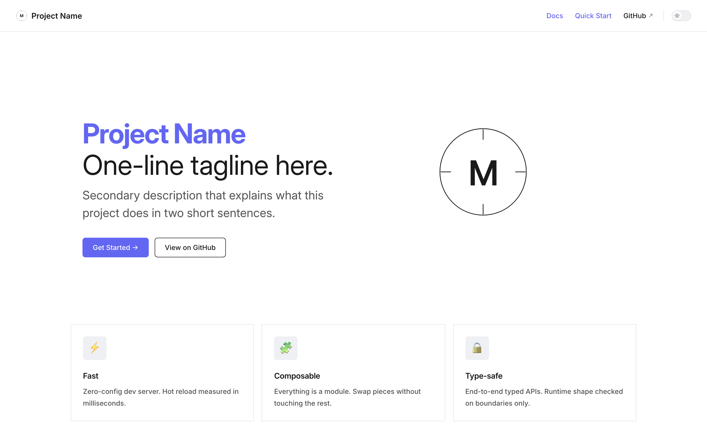
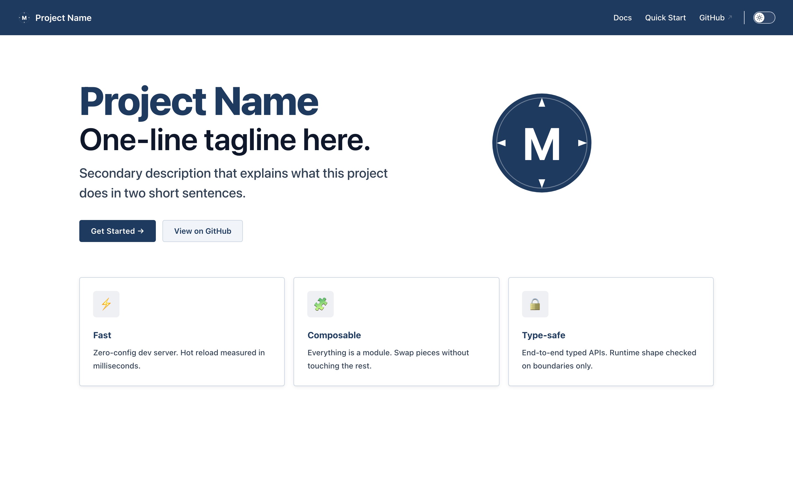
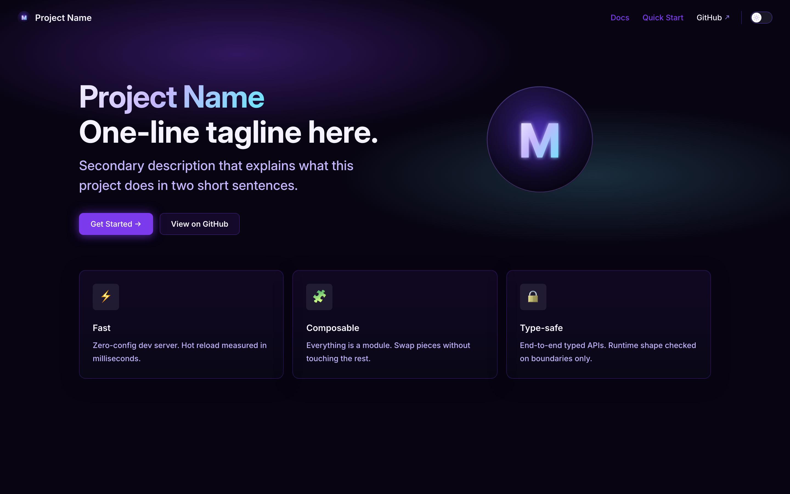
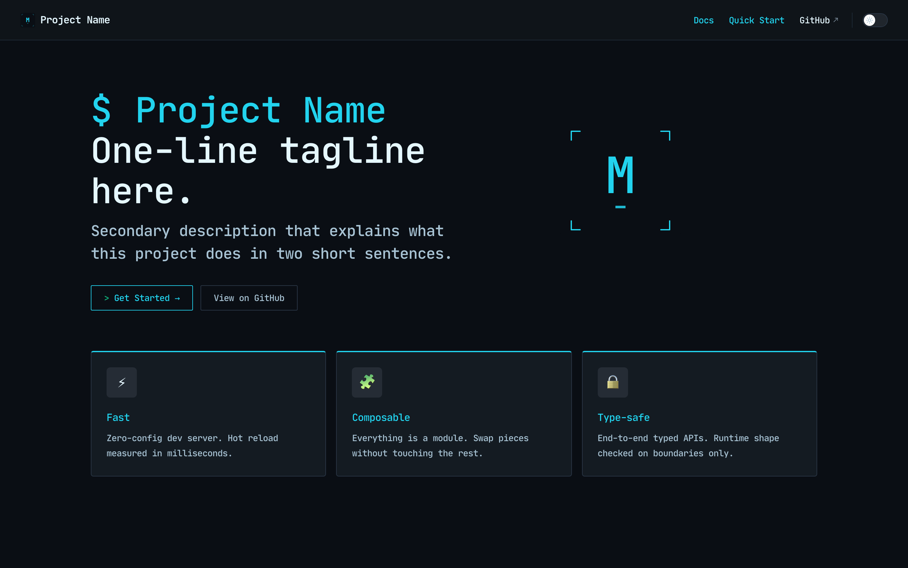

<!--
  Translation status:
  Source file : README.md
  Source commit: f603973
  Translated  : 2026-04-21
  Status      : up-to-date
-->

> **语言 / Language**: [简体中文](README.md) · **English** · [日本語](README.ja.md) · [繁體中文](README.zh-TW.md)

  

# Meridian

A promotion toolkit your AI assistant runs for you. Point Claude Code / Cursor / Windsurf at your project, say "set up promotion for it," and the AI generates your README, i18n, docs site, logo, AI-tool context files, and SEO + GEO assets — in one session.

[Quick Start](#quick-start) · [Docs](https://lordmos.github.io/meridian/en/) · [FAQ](https://lordmos.github.io/meridian/en/faq) · [GitHub](https://github.com/lordmos/meridian)

---

## Quick Start

Open the Meridian directory in an AI tool (Claude Code / Cursor / Windsurf, etc.) and say:

> Please read my project. The project directory is at `[your project path]`. Understand the project and set up the operations infrastructure for it.

The AI will first explore your project autonomously, then propose 3 color schemes for you to choose from, and list existing README issues. After your confirmation, the AI completes all operations work automatically.

You only need to do three things: ① Answer initial questions → ② Choose a color scheme → ③ Review the results.

**Resume after interruption** → Tell the AI: `Please read checkpoint.md and continue the unfinished work.`

---

## Style Library

Meridian ships 4 preset visual styles. The AI recommends one based on your project type; you can pick any. Each image below is a real VitePress home page rendered in that style:

<table>
<tr>
<td align="center" width="50%">
 
<strong>Minimalist</strong> — Monochrome ink · geometry 
CLI / libraries / docs-first
</td>
<td align="center" width="50%">
 
<strong>Enterprise</strong> — Navy medallion · rigid geometry 
B2B / platforms / compliance
</td>
</tr>
<tr>
<td align="center" width="50%">
 
<strong>Glow</strong> — Gradient aura · deep space 
AI / Agent / generative
</td>
<td align="center" width="50%">
 
<strong>Dev-native</strong> — Terminal · neon cyan 
shells / SDKs / infra
</td>
</tr>
</table>

Each style defines a full visual system — palette, logo, type stack, VitePress theme vars, icon style — not just colors. See [`templates/styles/`](templates/styles/).

---

## What Meridian Does

**Visual**
- Project Logo: SVG gradient-glow, color follows the user's chosen palette
- Unified theme: logo / docs site / icons share one color system

**Content**
- Brand Naming: English project name with historical/cultural significance + naming rationale
- i18n Localization: zh-CN / en / ja / zh-TW — four languages + translation-status tracking
- README Operationalization: badges + language switcher + Quick Start first + docs site link

**Docs Site**
- VitePress multilingual site + GitHub Pages auto-deployment

**AI Integration**
- Context files: CLAUDE.md / AGENTS.md / .cursor/rules / .windsurf/rules
- Orchestration entry: QUICK_START.md (one-line launch, AI runs the full workflow autonomously)

**Promotion (SEO + GEO)**
- SEO: Open Graph / Twitter Card / JSON-LD SoftwareApplication / sitemap.xml with hreflang / robots.txt — discoverable on Google / Bing
- GEO: [llms.txt](https://llmstxt.org) + llms-full.txt + structured FAQ page — quotable by ChatGPT / Claude / Perplexity in answer mode
- One 1200×630 OG social card per style (rich Facebook / Twitter / LinkedIn link previews)

Full 12-task checklist

| # | Task | Main output |
|---|------|-------------|
| 1 | Brand naming | English project name + naming rationale |
| 2 | i18n localization | `i18n/glossary.md` + `i18n/{en,ja,zh-TW}/` + `README.*.md` |
| 3 | VitePress docs site | `docs/` (theme vars derived from chosen style) |
| 4 | GitHub Pages deploy | `.github/workflows/docs.yml` |
| 5 | Project logo | `docs/public/hero.svg` + `.github/assets/hero.svg` |
| 6 | AI-tool context | `CLAUDE.md` / `AGENTS.md` / `.cursor/` / `.windsurf/` |
| 7 | QUICK_START.md | root `QUICK_START.md` |
| 8 | Quick Start Guide | `docs/quick-start.md` (four languages) |
| 9 | README operationalization | All language READMEs |
| 10 | Consistency check | `.gitignore` + build verification + i18n drift check |
| 11 | Emoji → SVG replacement | `docs/public/icons/` + all md files updated |
| 12 | Discoverability (SEO + GEO) | `robots.txt` + `og.png` + `llms.txt` + `llms-full.txt` + FAQ |

Per-task operational details in [`PROMPT.md`](PROMPT.md); sharded notes in [`templates/tasks/`](templates/tasks/).

---

## File Reference

| File | Description |
|------|-------------|
| `PROMPT.md` | Reusable operations prompt (the primary deliverable, contains 10 tasks) |
| `QUICK_START.md` | AI orchestration entry, written for AI assistants to read |
| `templates/` | Template files referenced by the prompt (VitePress config, GitHub Actions, Logo SVG, AI tool files, etc.) |

---

**The Meridian that Meridian built for itself.** README, badges, language switcher, [docs site](https://lordmos.github.io/meridian/), logo, AI-tool context — everything you see is self-generated.

Built with [Meridian](https://github.com/lordmos/meridian) · open-source ops toolkit
